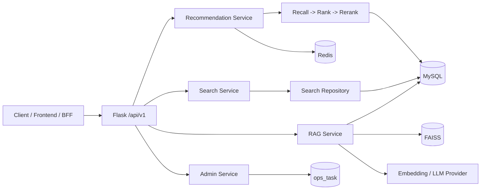

# RecommendationService

一个面向影视内容场景的推荐后端服务，提供个性化推荐、相似影片推荐、热门榜、条件搜索，以及基于 RAG 的中文问答能力；同时内置模型训练、索引重建、缓存预计算和运行时健康检查能力。

当前仓库更适合被理解为“推荐中台 / 推荐后端服务层”，主要面向上层 Web、App、BFF 或测试工具调用，而不是一个完整的前端产品。

## 核心能力

- 用户个性化推荐：走召回、排序、重排三段式在线流水线。
- 相似影片推荐：优先复用 RAG embedding，相似片检索失败时回退到 Two-Tower。
- 热门榜：按时间窗口输出趋势内容，并支持 Redis 预热。
- 条件搜索：支持关键词、标签、日期、时长等组合过滤。
- RAG 问答：基于影片元数据检索证据，并通过 SSE 返回流式回答。
- 训练与运维：支持模型训练、RAG 全量重建、运行时刷新和后台任务查询。

## 最短启动

1. 准备 Python、MySQL、Redis 和可用的模型 / 索引文件。
2. 执行 [all.sql](all.sql) 初始化数据库结构。
3. 按 [docs/02-getting-started/configuration-guide.md](docs/02-getting-started/configuration-guide.md) 检查并调整 [config.json](config.json)。
4. 安装依赖：`pip install -r requirements.txt`。
5. 启动服务：`python app.py`。
6. 调用 `GET /api/v1/health` 与 `GET /api/v1/admin/status` 验证 warmup、模型与 worker 状态。

如果你是第一次接手项目，不要直接从代码开始读。建议先看 [docs/index.md](docs/index.md) 中的阅读路径说明。

## 文档导航

### 首次运行

- [docs/index.md](docs/index.md)
- [docs/02-getting-started/environment-setup.md](docs/02-getting-started/environment-setup.md)
- [docs/02-getting-started/configuration-guide.md](docs/02-getting-started/configuration-guide.md)
- [docs/02-getting-started/first-run-checklist.md](docs/02-getting-started/first-run-checklist.md)
- [docs/02-getting-started/local-debugging-guide.md](docs/02-getting-started/local-debugging-guide.md)

### 架构与代码理解

- [docs/01-overview/project-overview.md](docs/01-overview/project-overview.md)
- [docs/01-overview/architecture-overview.md](docs/01-overview/architecture-overview.md)
- [docs/01-overview/repository-map.md](docs/01-overview/repository-map.md)

### 后续扩展方向

当前第一批文档已覆盖入口页、项目概览、架构总览和快速上手。后续建议继续补充以下专题文档：

- 推荐主链路说明
- 搜索链路说明
- RAG 详细实现
- 任务与训练 runbook
- 数据契约与缓存契约
- 完整 REST / SSE 接口参考

## 当前高层架构

更详细的分层、启动流程、并发模型和状态管理说明，见 [docs/01-overview/architecture-overview.md](docs/01-overview/architecture-overview.md)。

## 代码入口

- Web 入口：[app.py](app.py)
- 应用工厂：[app/__init__.py](app/__init__.py)
- 推荐服务门面：[app/services/recommendation_service.py](app/services/recommendation_service.py)
- 搜索服务门面：[app/services/search_service.py](app/services/search_service.py)
- RAG 核心服务：[app/reco/rag_service.py](app/reco/rag_service.py)
- 后台任务表访问：[app/ops/task_ops.py](app/ops/task_ops.py)

## 说明

- 根 README 现在只承担 landing page 角色，不再承载全部实现细节。
- 更深入的设计、配置、首启、排障文档统一放在 [docs](docs) 中维护。
- 如果需要把这个仓库作为对外交付物，请优先把 `config.json` 中的敏感信息改成安全配置来源，而不是直接保留明文密钥。