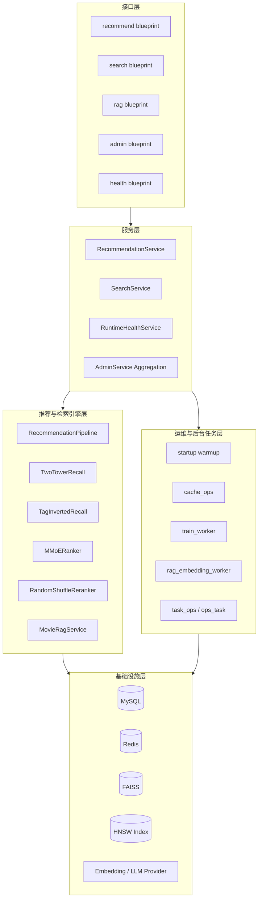
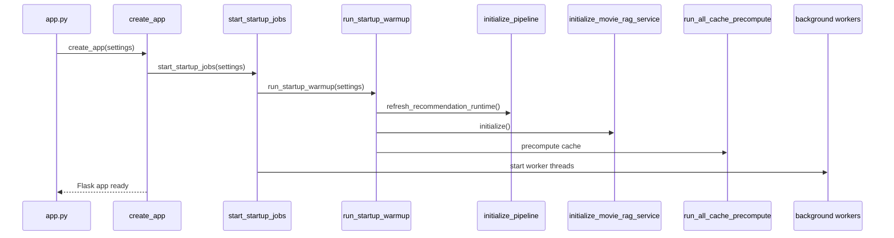

# Architecture Overview

## 文档目标

本文档面向需要理解系统整体结构的人，重点解释：

- 组件如何分层
- 服务如何启动
- 请求如何流转
- 后台任务如何协同
- 运行时状态如何表达

它不是完整代码细节手册，而是“高层架构 + 关键链路 + 运行模型”的说明文档。

## 1. 总体架构结论

RecommendationService 当前采用的是一种非常明确的工程结构：

- 单体 Flask 应用负责统一接口入口。
- 进程内完成 warmup、模型加载和索引加载。
- 进程内同时启动后台线程，处理缓存预热、周期刷新和队列轮询。
- MySQL 负责业务主数据、训练数据、RAG 冷存储和任务持久化。
- Redis 负责缓存、倒排索引和部分检索中间结果。
- 外部 Embedding / LLM 服务通过 OpenAI-compatible HTTP 协议接入。

这套架构不是为了“最时髦”，而是为了用较少组件把一个完整推荐系统快速落到可运行状态。

## 2. 分层视图

## 3. 部署模型

### 3.1 当前模型

当前最符合代码事实的部署模型是：

- 一个 Python 进程承载 Flask API。
- 同一个进程在启动时做同步 warmup。
- 同一个进程起多个 daemon 线程负责周期任务和任务轮询。

这意味着它不是以下任何一种：

- 纯 Web API 进程 + 独立队列 worker
- 微服务拆分架构
- Serverless 架构

### 3.2 当前模型的优点

- 本地开发和交付演示简单。
- 没有额外消息队列依赖。
- 启动后就能得到相对完整的运行态。
- 小规模团队维护成本较低。

### 3.3 当前模型的代价

- 启动时间更长，因为 warmup 不是懒加载。
- API 与后台任务共享进程资源。
- worker 崩溃和 API 进程故障的隔离不彻底。
- 长期看不如独立 worker 结构易扩展。

## 4. 启动生命周期

### 4.1 启动入口

服务从 [app.py](../../app.py) 进入：

1. 读取全局配置。
2. 调用应用工厂创建 Flask app。

### 4.2 应用工厂阶段

在 [app/__init__.py](../../app/__init__.py) 中，create_app 完成以下动作：

1. 初始化日志系统。
2. 创建 Flask 实例并设置 JSON 编码行为。
3. 注册 `/api/v1` 总蓝图。
4. 注册统一错误处理器。
5. 调用 `start_startup_jobs(settings)`。

### 4.3 warmup 阶段

warmup 的目标是把“运行时真正依赖的重资源”提前就绪，而不是等第一条请求触发。

当前 warmup 会做：

1. 刷新推荐运行时。
2. 必要时构建或刷新 Two-Tower 索引。
3. 初始化全局推荐 pipeline。
4. 初始化全局 RAG 服务与 FAISS 索引。
5. 运行缓存预计算任务。

### 4.4 后台线程阶段

warmup 完成后会启动以下线程：

- Two-Tower 刷新线程
- 缓存预计算线程
- 训练任务轮询线程
- RAG 重建任务轮询线程

### 4.5 启动顺序图

## 5. 在线请求路径

### 5.1 用户推荐路径

用户推荐路径经过：

1. `v1_recommend.py`
2. `RecommendationService.recommend_user`
3. Redis 用户推荐缓存
4. 缓存 miss 时进入 `RecommendationPipeline`
5. Recaller 聚合候选
6. MMoE 排序
7. 随机重排
8. 写回缓存或直接返回

这里最关键的架构点有两个：

- 用户推荐有缓存层，不是每次都实时跑模型。
- 缓存 miss 时有构建锁，不允许同一用户被多个并发请求重复构建。

### 5.2 搜索路径

搜索路径经过：

1. `v1_search.py` 做参数标准化
2. `SearchService` 做缓存签名与缓存读写
3. `SearchRepository` 做 SQL 查询
4. Fulltext 不可用或无结果时回退到 LIKE

这条路径的重点是“查询策略降级”，不是“模型推理”。

### 5.3 RAG 路径

RAG 路径经过：

1. `v1_rag.py` 接收 query 和 thinking
2. `MovieRagService.retrieve_evidence()`
3. 查询 embedding 并做 ANN 检索
4. 回表补齐影片元数据
5. 调用外部 LLM 获取流式文本
6. 对输出做结构化片段解析
7. 以 SSE 事件流返回给客户端

这里的关键不只是“生成回答”，而是生成后的结构化 `cited_movie_ids`，因为它让调用方能知道答案引用了哪些影片。

### 5.4 管理接口路径

管理接口大致分成两类：

- 同步触发型：例如刷新运行时、刷新单影片 embedding
- 异步任务型：例如训练、RAG 全量重建

异步任务型接口不会自己做重工作，而是把任务写进 `ops_task` 表，再由后台 worker 轮询消费。

## 6. 核心状态与共享单例

### 6.1 全局 Settings

配置通过 [app/common/settings.py](../../app/common/settings.py) 加载后，会被缓存为全局设置对象。大多数模块都围绕这个统一配置运行。

### 6.2 全局 RecommendationPipeline

pipeline 被构造成全局单例，由运行时模块管理。这样做的好处是：

- 避免每个请求重复加载模型
- 避免重复打开索引
- 便于统一刷新

### 6.3 全局 MovieRagService

RAG 服务同样使用全局单例，并在初始化时加载 FAISS 索引。它当前既承担问答证据检索，也承担相似片检索。

### 6.4 Runtime Health 快照

运行态并不是靠零散日志拼出来的，而是由 `runtime_health` 模块集中维护的组件状态：

- warmup
- pipeline
- rag
- two_tower_refresh_worker
- cache_precompute_worker
- train_queue_worker
- rag_rebuild_worker

这让外部可以通过健康检查接口直接判断“服务活着”和“服务可用”之间的差别。

## 7. 数据与基础设施依赖

### 7.1 MySQL

MySQL 在当前架构中承担的职责非常多：

- 业务主数据源
- 搜索回表数据源
- 在线特征源
- 离线训练样本源
- RAG embedding 持久化存储
- 任务表持久化存储

换句话说，MySQL 不只是“数据源之一”，而是这个系统的基础事实来源。

### 7.2 Redis

Redis 不是简单的性能优化。当前它实际承担了：

- 用户推荐缓存
- 推荐构建锁
- 搜索结果缓存
- 热门榜缓存
- 特征缓存
- Tag 倒排召回缓存
- RAG 部分映射缓存

关闭 Redis 后，系统不一定完全不可运行，但会显著退化，并且部分能力无法达到设计预期。

### 7.3 向量索引

当前有两类主要索引：

- Two-Tower HNSW 索引
- RAG FAISS 索引

二者虽然都做 ANN 检索，但语义不同：

- Two-Tower 更偏协同过滤 / 行为向量空间
- RAG 更偏影片内容语义向量空间

### 7.4 外部模型提供商

RAG 依赖外部服务提供：

- embedding
- chat completion

这使得 RAG 的可靠性同时受制于：

- 网络
- API Key
- provider 协议兼容性
- 响应时延

## 8. 后台任务架构

### 8.1 统一任务表

当前后台任务都围绕 `ops_task` 表展开。它的意义是把任务系统从“临时脚本”提升为“可查询、可审计、可恢复的状态机”。

### 8.2 当前任务类型

当前已经明确的任务类型有：

- `train_job`
- `rag_rebuild_job`

### 8.3 worker 协作方式

worker 的协作不是消息队列消费，而是数据库轮询：

- 查找 pending 任务
- claim 为 processing
- 执行任务
- 回写 progress / result / error
- 标记 completed 或 failed

这套机制简单，但足够清晰，特别适合当前单库、单团队、低外部依赖的场景。

## 9. 当前最关键的架构权衡

### 9.1 为什么选择单体 + 内嵌线程

这是一个典型的工程取舍：

- 优先减少系统组件数量
- 优先提升本地可运行性
- 优先保证一个仓库内就能跑完整链路

缺点是长期扩展空间不如拆分式架构大，但作为当前阶段，它更容易交付和维护。

### 9.2 为什么配置和运行时耦合较深

当前配置直接决定：

- 使用哪个模型文件
- 使用哪个索引文件
- 是否开启 Tag 倒排召回
- 用户推荐缓存交付模式
- RAG 使用哪个 provider

这使项目具备较高的可调节性，但也让错误配置的影响非常直接。

### 9.3 为什么搜索、推荐、RAG 共用同一服务

这本质上是为了共享同一份基础数据、缓存体系和运行态，而不是把每种能力分散成独立服务。

优点是：

- 数据一致性和模型路径一致性更容易维护
- 管理接口可以集中输出整体状态
- 调试路径更短

## 10. 从架构视角看当前最重要的风险点

1. 启动 warmup 较重，服务可用性依赖多个模型和索引文件同时就绪。
2. API 与 worker 共进程，资源争用不可忽视。
3. RAG 依赖外部 provider，外部可用性会直接影响部分在线功能。
4. 活跃模型目录、历史产物目录和配置路径需要保持一致，否则容易出现“训练成功但运行时未切换”。
5. Redis 关闭或不可用时，多项在线能力会降级。

## 11. 接下来建议读什么

如果你需要进一步落到代码结构层面，请继续看 [repository-map.md](repository-map.md)。